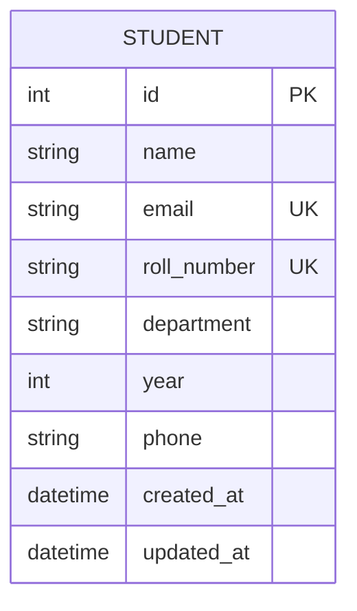

# Database / ER Diagram

## Entity: Student

| Column        | Type          | Constraints                     |
|---------------|---------------|-----------------------------------|
| id            | BigAutoField  | Primary Key, Auto-increment       |
| name          | CharField(100)| NOT NULL                          |
| email         | EmailField    | NOT NULL, UNIQUE                  |
| roll_number   | CharField(20) | NOT NULL, UNIQUE                  |
| department    | CharField(100)| NOT NULL                          |
| year          | SmallInteger  | NOT NULL, choices 1–5              |
| phone         | CharField(10) | NULLABLE, 10-digit format          |
| created_at    | DateTime      | Auto-set on creation                |
| updated_at    | DateTime      | Auto-updated on save                |

## Diagram (Mermaid)

This is a single-entity schema for the base version of the system. Future
enhancements (see README) could add related entities such as `Course` or
`Enrollment` with a many-to-many relationship to `Student`.
